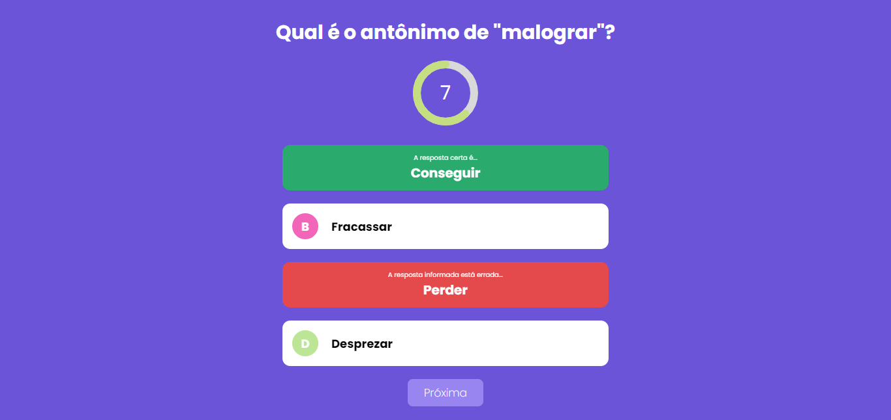
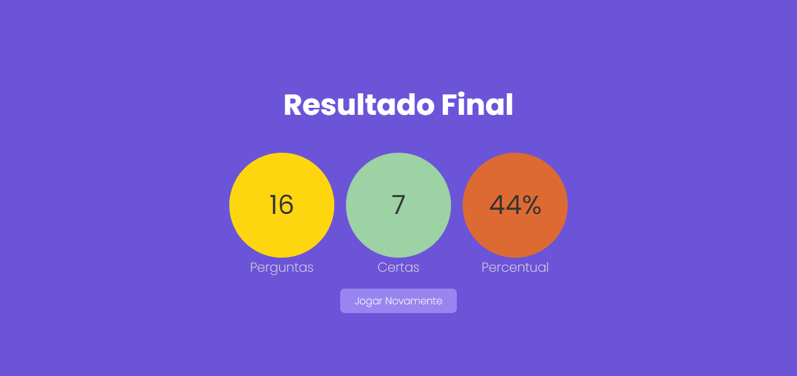

# Quiz
Jogo quiz. Responda as perguntas corrretamente.




## ✨ Tecnologias
React | Next | TypeScript

## 💻 Uso
Em seu terminal:
```bash
# Clone o repositório
git clone https://github.com/ViGF/Quiz.git
# Acesse a pasta do projeto
cd Quiz
# Instale as dependências
yarn add
# Execute a aplicação
yarn run dev
#Agora basta acessar a aplicação
```

<div align="center">
  <small>Desenvolvido por Vitório Gomes - Agosto/2022</small>  
</div>